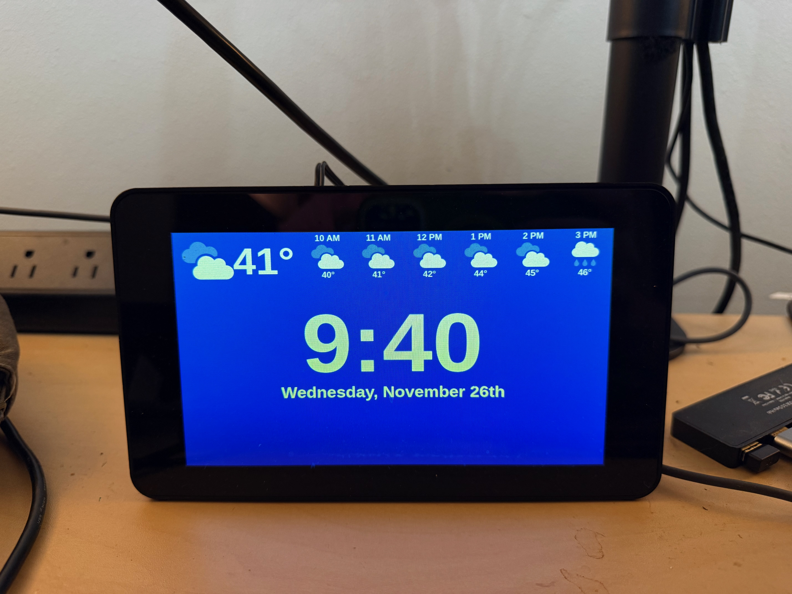

# Clockdash
This app powers a simple clock and local weather forecast widget that sits on my desk running in a raspberry pi.



Run ./deploy.sh to deploy to a pi.

# Pi configuration
Set these up manually for now:
- Create a service that runs `npm serve` out of the `~/clockdash-vite` dir
- Create an auto-start script that launches chromium browser in kiosk mode pointed to   http://0.0.0.0:3000 (or whatever port runs the server)

# Env Vars

The following env vars must be set in a `.env` file at the root directory:
```
VITE_OPENWEATHER_API_KEY= // API key for OpenWeatherAPI

// Location to show weather for.
VITE_WEATHER_LAT=45.72778806045063
VITE_WEATHER_LON=-121.48423553656941

DEPLOY_HOST= # pi to deploy to
DEPLOY_USER= # username for pi to deploy to
DEPLOY_PASS= # user password
```